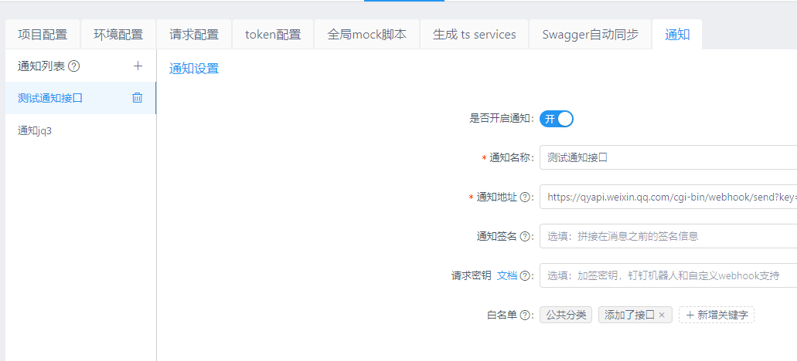

yapi-plugin-notifier
===

自定义通知机器人，支持企业微信通知。使用过程中如果碰到任何bug或有任何好的的建议欢迎issue。

## 功能

- [x] webhook
- [x] 企业微信机器人
- [x] 钉钉机器人

## 安装

第一步：在config.json这层目录下运行 ```yapi plugin --name yapi-plugin-notifier```安装插件

第二步：修改config.json的配置

```json
{
    "name": "notifier",
    "options": {
      "host": "http://localhost:3000"
    }
}
```

**host**必须配置，否则通知中的链接点击无法正常跳转。

第三步： 重启服务器


## 使用


在每个项目的设置处新增通知设置，根据需求选择相应的配置。

## 更新

通过yapi-cli更新插件还是比较麻烦的，直接再执行一次命令并不会更新。因为yapi-cli安装插件实际上就是在vendors目录下执行`npm install --registry https://registry.npm.taobao.org yapi-plugin-notifier`，所以最后会在package.json文件中记录下开始安装的版本号，再次执行安装的还是同一个版本。

执行如下操作可以进行更新：
1. 需要先清除ykit的缓存，删除`./vendors/node_modules/.ykit_cache`文件夹
2. 修改package.json里面`yapi-plugin-notifier`的版本或者直接`npm i yapi-plugin-notifier@version`
3. 在`./vendors/`目录中执行命令`NODE_ENV=production ykit pack -m`
4. 在config.json这层目录下执行命令`yapi plugin --name yapi-plugin-notifier`后再重启服务器就完成安装指定版本的插件

## 注意事项

1. 企业微信每个机器人发送的消息不能超过20条/分钟，最新内容参考[消息发送频率限制](https://work.weixin.qq.com/api/doc/90000/90136/91770#%E6%B6%88%E6%81%AF%E5%8F%91%E9%80%81%E9%A2%91%E7%8E%87%E9%99%90%E5%88%B6)，建议在配置短时间频繁更改的情况下关闭通知的开关。

感谢[https://github.com/zgs225/yapi-plugin-dding](https://github.com/zgs225/yapi-plugin-dding)提供的参考，一个受欢迎的钉钉机器人推送插件。
